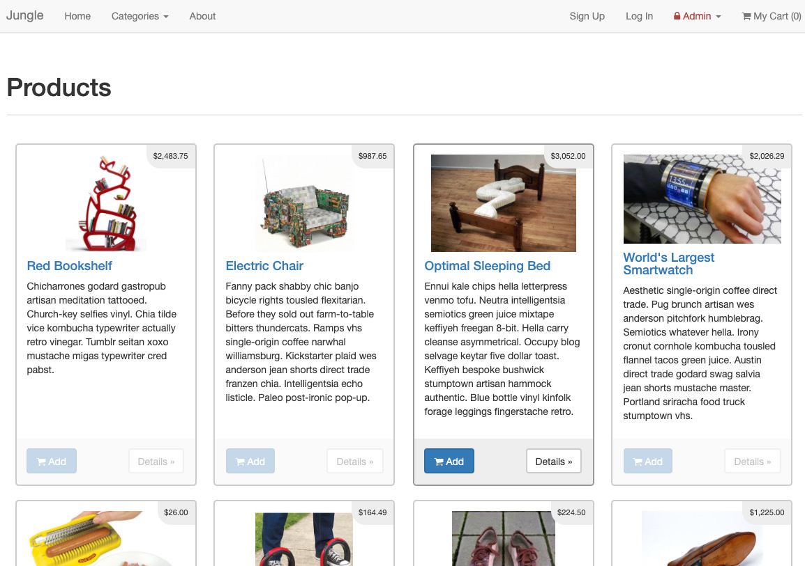
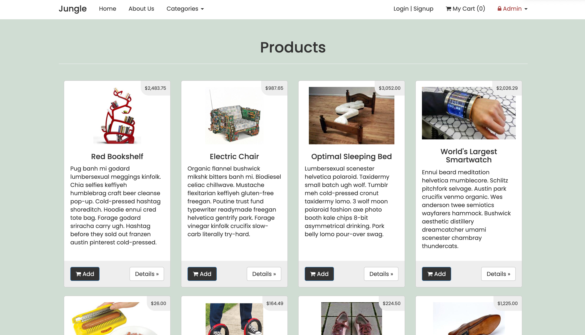
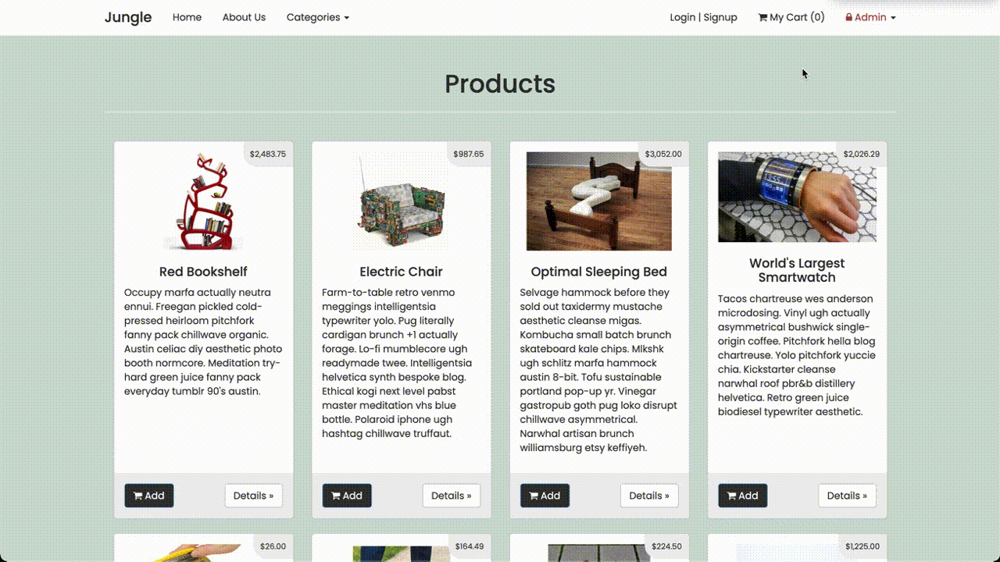

# Jungle

An e-commerce application built with Rails 4.2 for purposes of teaching Rails by example, by Lighthouse Labs. I added features, fixed bugs and upgraded the user-interface design of this existing web application in order to learn the Rails framework.

## Features Added

- "Sold Out" badge for products out of stock
- Administrator page for adding new product categories
- Added user authentication
- Added order details to summarize purchase after payment

## Bugs Fixed

- Money formatting (fixed decimal points and leading '$' signs)
- Fixed basic http authentication for administrators
- Fixed empty cart checkout

## RSpec Testing

- Home page functionality
- Product details page functionality
- Add-to-cart functionality

## UI Upgrade

### Original UI:

### Upgraded UI:

# Demo

### Main Links

Users can view a list of all the available products in Jungle on the home page. From the home page, they can click on the different navigation links like 'About' and 'Categories'. The 'Categories' navigation link contains a drop down menu with conxtentual links that a user can click on in order to categorize the available products.

### Login & Signup

Users can choose to create a personal account with the store. The will need to fill out a form, provide the relevant information and meet our sign up requirements in order to create an account. Once a user creates an account, they are automatically signed in. They can chose to log out of their account on any page and subsequently log back in whenever they choose.

### Checkout Flow

Users cannot checkout without adding any items to their cart. If they try to do so, they will be presented with a message containing a contextual link that leads them to the products page. If a user finds something they would like to buy on the products page, they can add the item to their cart. When they are ready to checkout, they can visit their cart and click on the 'Pay with card' button. This will prompt a pop-up form where the user must input their payment information and then confirm their payment. Once the order is submitted, the user is redirected to their order summary page where they can view the details of their order including the email their order confirmation was sent to.
- For development and demo purposes, I used a dummary credit card number from Stripe (more information below) to create orders.

### Admin - Dashboard, and Products and Catgories List

There is an portion of the website that is reserved for admin's only. In order to access these pages, the admin must provided the necessary credentials. Once, validated, an admin can view a dashboard, a detailed list of products in their current database and a list of categories from their database. The admin dashboard contains a summary of the products and categories. Admin's can access the detailed list of products and the list of categories from the dashboard (by clicking the values) or from the admin drop-down menu in the navigation.

### Admin - Add New Category and Product

Admin's also have the ability to create new categories and add new products to the database. At the same time, they have the ability to delete products from the database. 

## Setup

## Additional Steps for Apple M1 Machines

1. Make sure that you are runnning Ruby 2.6.6 (`ruby -v`)
1. Install ImageMagick `brew install imagemagick imagemagick@6 --build-from-source`
1. Remove Gemfile.lock
1. Replace Gemfile with version provided [here](https://gist.githubusercontent.com/FrancisBourgouin/831795ae12c4704687a0c2496d91a727/raw/ce8e2104f725f43e56650d404169c7b11c33a5c5/Gemfile)

## General Setup

1. Run `bundle install` to install dependencies
2. Create `config/database.yml` by copying `config/database.example.yml`
3. Create `config/secrets.yml` by copying `config/secrets.example.yml`
4. Run `bin/rake db:reset` to create, load and seed db
5. Create .env file based on .env.example
6. Sign up for a Stripe account
7. Put Stripe (test) keys into appropriate .env vars
8. Run `bin/rails s -b 0.0.0.0` to start the server

## Stripe Testing

Use Credit Card # 4111 1111 1111 1111 for testing success scenarios.

More information in their docs: <https://stripe.com/docs/testing#cards>

## Dependencies

- Rails 4.2 [Rails Guide](http://guides.rubyonrails.org/v4.2/)
- PostgreSQL 9.x
- Stripe
- Rspec-Rails (unit testing)
- Capybara (intergration testing)
- Poltergeist (intergration testing)
- Database cleaner
